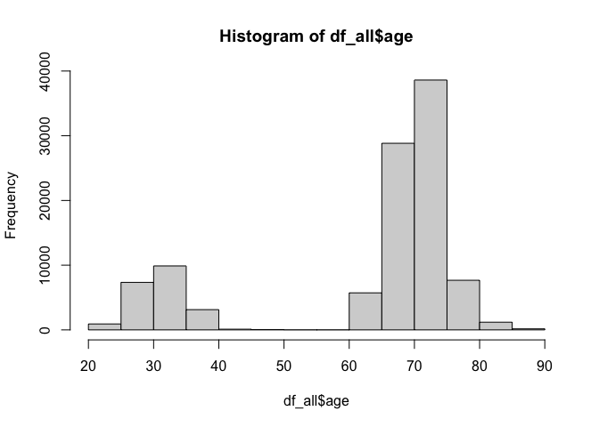
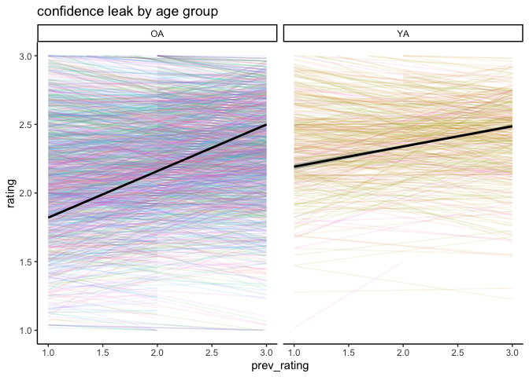

-   [Documentation](#documentation)
-   [plot by age group](#plot-by-age-group)

### Documentation

In this file, we are preparing the data for confidence leak analysis

``` r
# get the data first

# retrieve the long dataset
df_all<-read_spss( "FaceProfession_ses01.sav")

# select only recognition task
df_all<-df_all[df_all$subtask==4,]

# select the variables of interest
VoI<-c("vpid" ,"age.beha.cor", "secondprofessiontypestr", "response2str",
       "response2correct", "rating")

df_all<-df_all[, VoI]

# change the names
names(df_all)[c(2, 3, 4, 5)]<-c("age", "type", "response", "accuracy")

# crate the age variable
hist(df_all$age)
```



``` r
# The maximum age for YA is 46, so we can use the following heuristics to
# assign age group
df_all$agegroup<-ifelse(df_all$age<50,"YA", "OA")

# check how many participants and if we have the same trials by participant
countT1<- df_all %>% 
          group_by(vpid)%>%
          tally()

# check how many trials we have
unique(countT1$n)
```

    ## [1] 54

``` r
# now create a variable indicating the rating on the previous trial
df_all$prev_rating<-NA

participants<-unique(df_all$vpid)

# we need a list to append participants' data
list_all<-list()

# loop through participants to create the files
for (p in 1:length(participants)){
  
  # subset the file
  curr_df<-df_all[df_all$vpid==participants[p], ]
  
  # loop throught the trials of this participant
  for (t in 1:nrow(curr_df)){
    
    if (t>1){
      curr_df$prev_rating[t]<-curr_df$rating[t-1]
    }
    
  }
  
  # assign the df to the list
  list_all[[p]]<-curr_df
  
}

# merge all the files
all_df<-do.call(rbind, list_all)
```

# plot by age group

``` r
ggplot(all_df, aes(x =prev_rating, y = rating))+
   geom_line(stat="smooth",method = "lm",  
             formula=y~x, alpha=0.1)+
    aes(colour = factor(vpid), alpha=0.1)+
    geom_smooth(method="lm",formula=y~x,
                colour="black", se=T)+
  facet_grid(. ~ agegroup)+theme_classic()+
  ggtitle("confidence leak by age group")+
  theme(legend.position="none")+
  ylim(1,3)
```

    ## Warning: Removed 1919 rows containing non-finite values (`stat_smooth()`).
    ## Removed 1919 rows containing non-finite values (`stat_smooth()`).

    ## Warning: Removed 712 rows containing missing values (`geom_line()`).


analyze

``` r
all_df$rating<-as.numeric(all_df$rating)
all_df$vpid<-as.character(all_df$vpid)

conf_leak_mod<-lmer(rating~prev_rating*agegroup+(prev_rating|vpid), data = all_df,
                    control=lmerControl(optimizer="bobyqa",optCtrl=list(maxfun=100000)))

summary(conf_leak_mod)
```

    ## Linear mixed model fit by REML. t-tests use Satterthwaite's method [
    ## lmerModLmerTest]
    ## Formula: rating ~ prev_rating * agegroup + (prev_rating | vpid)
    ##    Data: all_df
    ## Control: lmerControl(optimizer = "bobyqa", optCtrl = list(maxfun = 1e+05))
    ## 
    ## REML criterion at convergence: 200530
    ## 
    ## Scaled residuals: 
    ##     Min      1Q  Median      3Q     Max 
    ## -3.0631 -0.6385  0.1183  0.7260  3.0438 
    ## 
    ## Random effects:
    ##  Groups   Name        Variance Std.Dev. Corr 
    ##  vpid     (Intercept) 0.194781 0.44134       
    ##           prev_rating 0.006834 0.08267  -0.58
    ##  Residual             0.395547 0.62893       
    ## Number of obs: 101707, groups:  vpid, 1919
    ## 
    ## Fixed effects:
    ##                          Estimate Std. Error         df t value Pr(>|t|)    
    ## (Intercept)             2.145e+00  1.429e-02  1.777e+03 150.138  < 2e-16 ***
    ## prev_rating             4.645e-02  4.279e-03  1.969e+03  10.854  < 2e-16 ***
    ## agegroupYA              2.456e-01  3.088e-02  1.704e+03   7.952 3.31e-15 ***
    ## prev_rating:agegroupYA -4.241e-02  8.739e-03  1.593e+03  -4.853 1.33e-06 ***
    ## ---
    ## Signif. codes:  0 '***' 0.001 '**' 0.01 '*' 0.05 '.' 0.1 ' ' 1
    ## 
    ## Correlation of Fixed Effects:
    ##             (Intr) prv_rt aggrYA
    ## prev_rating -0.739              
    ## agegroupYA  -0.463  0.342       
    ## prv_rtng:YA  0.362 -0.490 -0.732

``` r
Anova(conf_leak_mod)
```

    ## Analysis of Deviance Table (Type II Wald chisquare tests)
    ## 
    ## Response: rating
    ##                       Chisq Df Pr(>Chisq)    
    ## prev_rating          94.546  1  < 2.2e-16 ***
    ## agegroup             41.701  1  1.063e-10 ***
    ## prev_rating:agegroup 23.554  1  1.214e-06 ***
    ## ---
    ## Signif. codes:  0 '***' 0.001 '**' 0.01 '*' 0.05 '.' 0.1 ' ' 1
